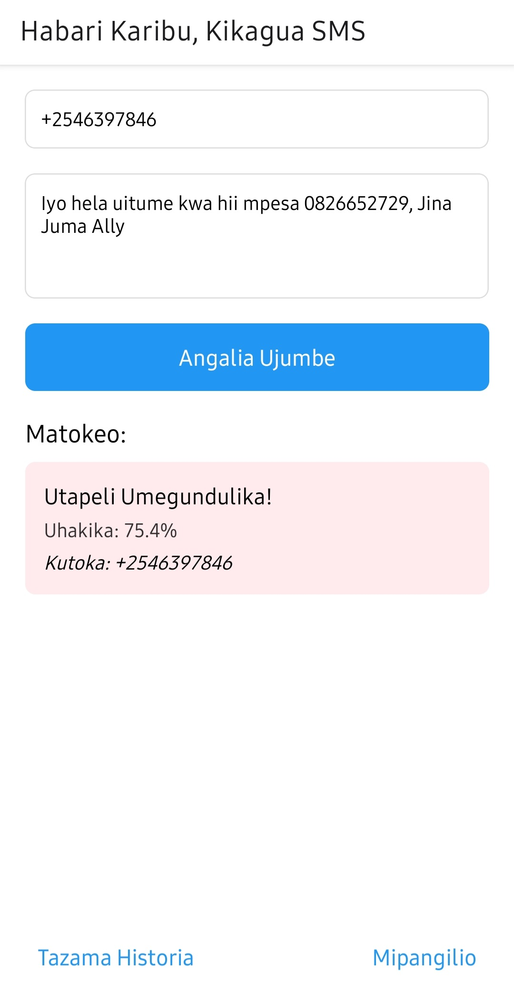
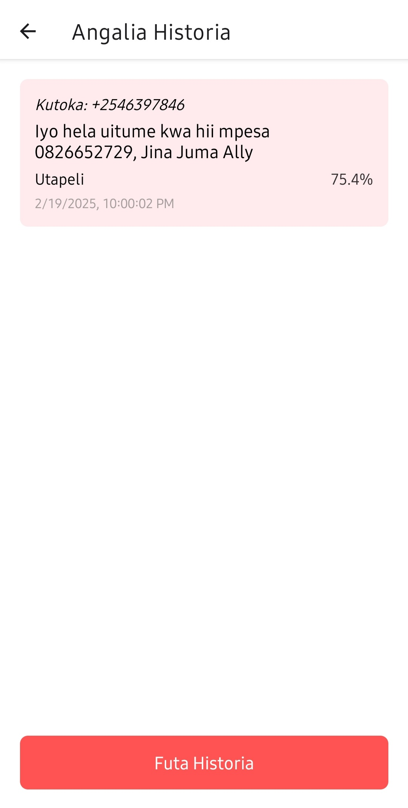
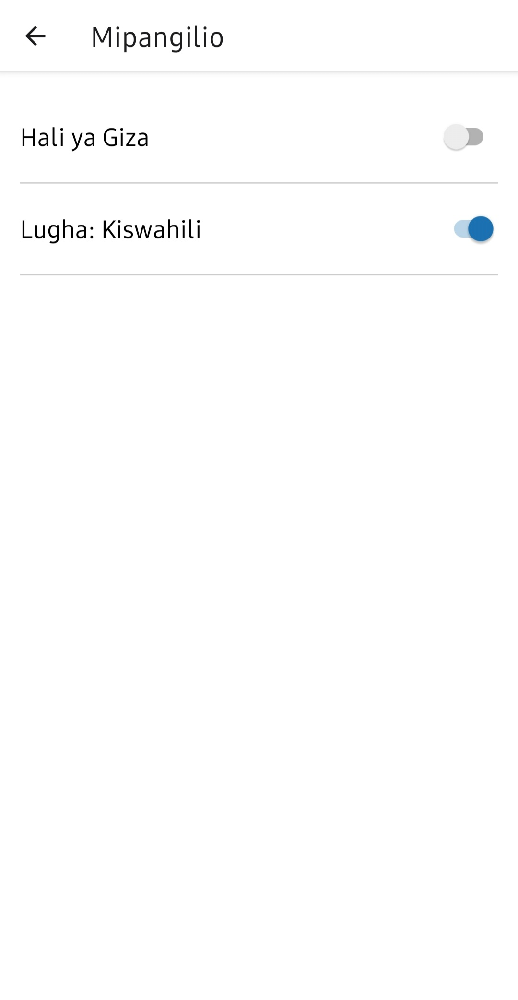

# SMS Gateway Spam Filter

A full-stack application that uses machine learning to detect and filter spam SMS messages in real-time, with a Flask backend and web dashboard for monitoring.

## Features

- **Real-time SMS Spam Detection:**  
  Classify incoming SMS messages as spam or legitimate using a pre-trained machine learning model.
- **Web Dashboard:**  
  Monitor filtered messages with timestamp, sender, recipient, and confidence scores.
- **Africa's Talking Integration:**  
  Seamless integration with the Africa's Talking SMS API.
- **RESTful API:**  
  Exposes endpoints to receive and process incoming messages.
- **Environment-based Configuration:**  
  Uses environment variables for secure credential management.
- **Detailed Logging:**  
  Comprehensive logging for troubleshooting and monitoring.

## Screenshots






## Project Structure

```
sms-gateway-filter/
├── app.py                   # Main Flask application
├── spam_model.pkl           # Trained machine learning model
├── vectorizer.pkl           # TF-IDF vectorizer 
├── requirements.txt         # Python dependencies
├── .env                     # Environment variables (not tracked in Git)
├── templates/               # HTML templates for web dashboard
│   └── dashboard.html       # Dashboard UI
├── README.md                # This file
└── .gitignore               # Files to ignore (e.g., .env, __pycache__)
```

## Prerequisites

- Python 3.7+
- pip (Python package manager)
- Africa's Talking account with API credentials

## Installation

1. **Clone the Repository:**

   ```bash
   git clone https://github.com/yourusername/sms-gateway-filter.git
   cd sms-gateway-filter
   ```

2. **Create a Virtual Environment:**

   ```bash
   python -m venv venv
   ```

3. **Activate the Virtual Environment:**

   - **On Windows:**

     ```bash
     venv\Scripts\activate
     ```

   - **On macOS/Linux:**

     ```bash
     source venv/bin/activate
     ```

4. **Install Dependencies:**

   ```bash
   pip install -r requirements.txt
   ```

5. **Configure Environment Variables:**

   Create a `.env` file in the project root with the following content:

   ```env
   AT_USERNAME=your_africastalking_username
   AT_API_KEY=your_africastalking_api_key
   ```

   **Note:** Ensure that `.env` is added to your `.gitignore` so it isn't pushed to GitHub.

6. **Ensure ML Model Files Exist:**
   
   Make sure you have:
   - `spam_model.pkl`
   - `vectorizer.pkl`

7. **Start the Flask Application:**

   ```bash
   python app.py
   ```

## Usage

### Available Endpoints

- **GET /** - Web dashboard for viewing filtered messages
- **POST /incoming-messages** - Endpoint for receiving SMS messages
- **GET /test** - Simple endpoint to verify server status

### Sending Test Messages

You can test the API by sending a POST request to the `/incoming-messages` endpoint:

```bash
curl -X POST http://localhost:5000/incoming-messages \
  -H "Content-Type: application/json" \
  -d '{"from": "+1234567890", "text": "Hello, this is a test message", "to": "+0987654321"}'
```

### Message Processing

When a message is received:
1. The system extracts the sender, message content, and recipient
2. The machine learning model analyzes the message to determine if it's spam
3. Results are stored with confidence scores and timestamps
4. All processed messages appear in the web dashboard

## Development

### Logging

The application uses Python's built-in logging module. Debug logs can be found in the console output when running in debug mode.

### Extending the Filtering Model

To update or improve the spam detection model:

1. Train a new model using scikit-learn
2. Export the model and vectorizer:
   ```python
   import pickle
   with open('spam_model.pkl', 'wb') as f:
      pickle.dump(model, f)
   with open('vectorizer.pkl', 'wb') as f:
      pickle.dump(vectorizer, f)
   ```
3. Replace the existing files in the project directory

## Troubleshooting

- **API Connection Issues:**  
  Verify your Africa's Talking credentials in the `.env` file.

- **Model Loading Errors:**  
  Ensure that both `spam_model.pkl` and `vectorizer.pkl` are in the project root directory.

- **Server Access:**  
  If accessing from other devices, modify the Flask run configuration:
  ```python
  if __name__ == '__main__':
      app.run(debug=True, host='0.0.0.0')
  ```

## License

[MIT License](LICENSE)

## Acknowledgements

- **Africa's Talking** for the SMS API
- **Flask** for the backend framework
- **scikit-learn** for machine learning utilities
